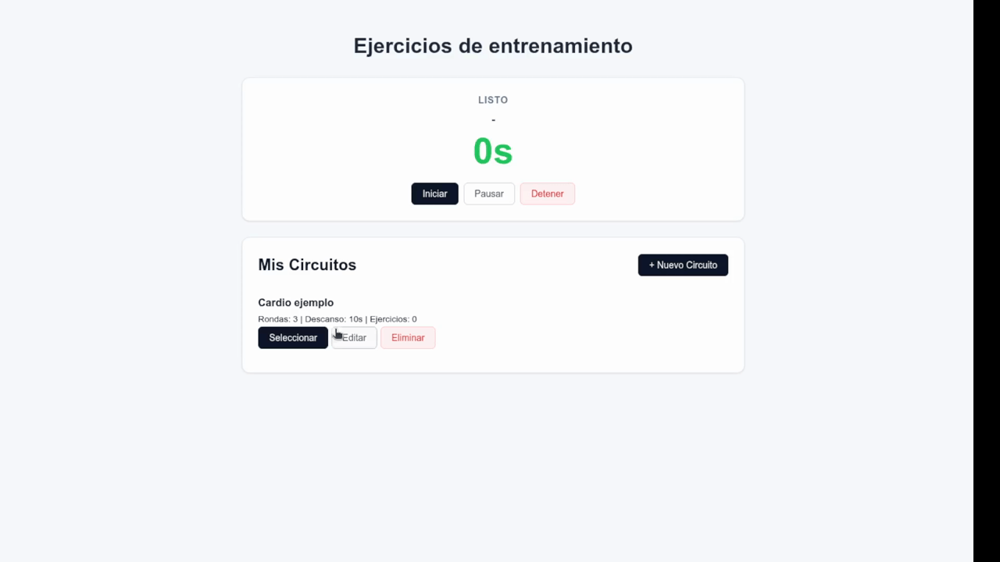

# js-workout-circuits
Aplicación web de diseño modular diseñada para la gestión, ejecución y seguimiento de rutinas de entrenamientos por circuitos.

Ofrece una interfaz centrada y limpia con indicadores sonoros en tiempo real para mantener el enfoque durante el entrenamiento sin distracciones.

## Demostración en vivo
Aquí puedes ver cómo se gestionan los circuitos y cómo funciona el temporizador con alertas sonoras en tiempo real:



<video src="https://github.com/Paredes/js-workout-circuits/blob/main/assets/video/demo-timer.mp4" width="98%" controls></video>


## Características principales

* Gestión Completa de Circuitos (CRUD): Creación, modificación y organización de ejercicios, tiempos de trabajo, descansos y rondas mediante ventanas modales nativas.

* Temporizador en Tiempo Real: Interfaz enfocada en la usabilidad durante la ejecución del circuito.

* Indicadores Sonoros: Avisos audibles para el inicio, conteo regresivo y cambio de intervalo.

## Próximas Funcionalidades
* [ ] Presets de rutinas precargadas (HIIT, Tabata, Fuerza).
* [ ] Historial de entrenamientos realizados.

## Instalación y uso Local
No requiere dependencias de Node.js ni procesos de compilación.

1. Clona el repositorio:


```
git clone https://github.com/Paredes/js-workout-circuits.git
```

2. Abre el archivo `index.html` directamente en tu navegador o mediante una extensión como **Live Server** en VS Code.

## Licencia
Este proyecto está bajo la Licencia **MIT** - consulta el archivo [LICENSE](LICENSE) para más detalles.
